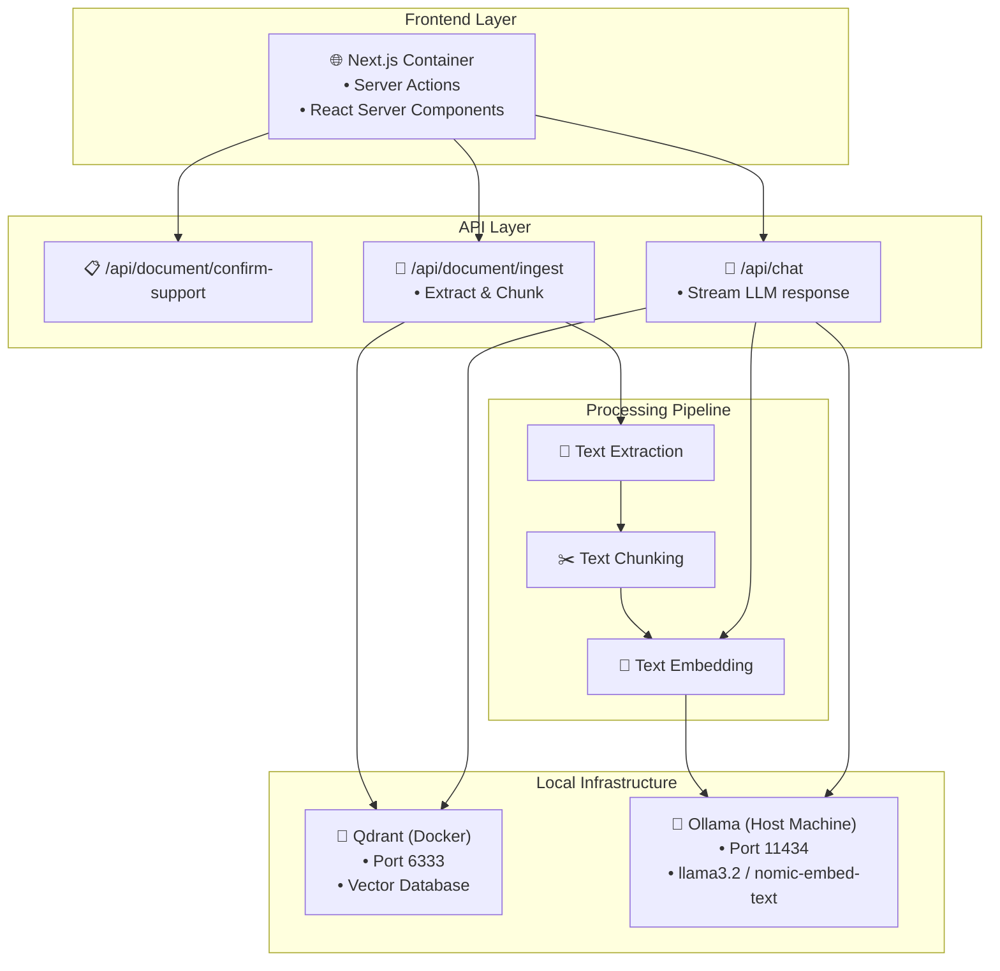

# 🤖 DocoChat AI — Intelligent Document Conversations

<div align="center">

[](https://nextjs.org/)
[](https://www.typescriptlang.org/)
[](https://www.docker.com/)
[](https://qdrant.tech/)
[](https://ollama.com/)
[](https://tailwindcss.com/)

**A zero-configuration, locally hosted Retrieval-Augmented Generation (RAG) application.**

*Upload • Extract • Embed • Chat*

**_100% Local & Private. All documents, vector embeddings, and inference run entirely on your hardware._**

</div>

---

## 📺 Live Demo & Deployment Philosophy

<div align="center">
  <a href="https://youtu.be/amWtA5Oci-E">
    
  </a>
  <br/>
  <i>Click the image above to watch the full working demonstration! 🚀</i>
</div>

<br/>

**Why isn't this deployed live?**  
Hosting an AI application with dedicated vector databases and LLM inference engines is highly resource-intensive and costly. As an engineer, making pragmatic economic decisions is crucial. Rather than burning ongoing cloud compute credits to host a live demo of an app that is fundamentally designed for **local, private execution**, I have recorded a comprehensive video walkthrough showcasing its capabilities.

The true architectural value of this project shines in its **zero-configuration local deployment**. Anyone reviewing this codebase—recruiters or engineers—can clone the repository, run `docker compose up`, and have the entire RAG pipeline running perfectly on their own machine in minutes.

---

## 🌟 Engineering Overview

DocoChat AI is engineered to be a completely self-contained, privacy-first document analysis tool. Rather than relying on managed cloud services for vector storage or LLM inference, it orchestrates a complete RAG pipeline locally using **Docker**, **Qdrant**, and **Ollama**.

### ✨ Architectural Highlights

- **Containerized Next.js** — Utilizes Next.js `output: 'standalone'` mode within a multi-stage Docker build, minimizing the image size securely while maintaining dynamic server-side capabilities (Server Actions & API Routes).
- **Local Vector Search** — Deploys a Qdrant container alongside the application via `docker-compose`, providing instant cosine-similarity vector search with zero network latency.
- **Host-Bound Inference** — Securely interfaces with Ollama running on the host machine (`host.docker.internal`), allowing the containerized app to harness the host's GPU/CPU for heavy model inference (`llama3.2` and `nomic-embed-text`).
- **Streaming UI** — Leverages the Vercel AI SDK to stream generative tokens back to the client in real-time, providing a highly responsive user experience.

---

## 🚀 Features

### 📄 Document Ingestion
- **Format Support**: PDF, DOCX, TXT, MD, CSV, RTF.
- **Extraction & Chunking**: Automatic parsing and semantic chunking of documents before embedding to ensure high-quality context retrieval.

### 🤖 AI Pipeline
- **Local Embeddings**: Uses `nomic-embed-text` to generate high-dimensional vectors for document chunks.
- **Semantic Retrieval**: Qdrant vector store handles efficient Nearest Neighbor search to fetch contexts.
- **Generative Inference**: `llama3.2` processes the retrieved context alongside the user's query to generate accurate, source-backed responses without hallucination.

---

## 🛠️ Getting Started (Zero-Config Setup)

The project is heavily optimized for a simple, one-command deployment. There is no need for local API keys or complex setups.

### Prerequisites

1. **[Docker Desktop](https://www.docker.com/products/docker-desktop/)** / **[OrbStack](https://orbstack.dev)** installed and running on your machine.
2. **[Ollama](https://ollama.com/)** installed and running on your host machine.

### 1. Download Required AI Models
Open your host terminal and pull the required models into Ollama:
```bash
ollama pull llama3.2
ollama pull nomic-embed-text
```

### 2. Start the Application
Clone the repository and spin up the complete environment using Docker Compose:
```bash
git clone https://github.com/hemants1703/docochat-ai.git
cd docochat-ai

# Build and start the Next.js app + Qdrant Vector database
docker compose up --build -d
```

### 3. Start Chatting
Open [http://localhost:3000](http://localhost:3000) in your browser. 
You can now upload documents and interact with them immediately!

*(Note: Ensure your local Ollama app is actively running on your host machine so the Docker container can communicate with it).*

---

## 🏗️ System Architecture Flow

<div align="center">



</div>

---

## 📄 License

This project is licensed under the **MIT License** - see the [LICENSE](LICENSE) file for details.

---

<div align="center">

### 🌟 Star this project if you find it useful!

**Made with ❤️ by [Hemant Sharma](https://github.com/hemants1703)**

</div>
